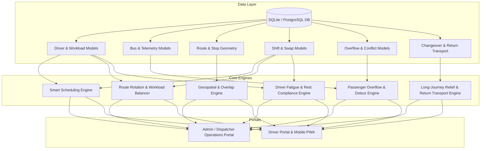

# CityFlow — Comprehensive Feature Specification & Architecture Roadmap

This document provides a complete, authoritative division of features across the **CityFlow** intelligent transit ecosystem based on all 8 GitHub issues (`#1` through `#8`) from [shi-ivam/CityFlow](https://github.com/shi-ivam/CityFlow).

---

## 📑 Table of Contents

1. [System Overview & Architecture Principles](#1-system-overview--architecture-principles)
2. [GitHub Issues Mapping Matrix](#2-github-issues-mapping-matrix)
3. [Admin / Dispatcher Portal Features](#3-admin--dispatcher-portal-features)
4. [Driver Portal Features & Complete TODO List](#4-driver-portal-features--complete-todo-list)
   - [Module 1: Authentication, Duty & Shift Management](#module-1-authentication-duty--shift-management)
   - [Module 2: Workload Fairness, Route Rotation & Fatigue Compliance](#module-2-workload-fairness-route-rotation--fatigue-compliance)
   - [Module 3: Active Trip Execution, Passenger Capacity & Navigation](#module-3-active-trip-execution-passenger-capacity--navigation)
   - [Module 4: Passenger Overflow Reporting & Assisting Driver Detour Rerouting](#module-4-passenger-overflow-reporting--assisting-driver-detour-rerouting)
   - [Module 5: Long-Journey Driver Relief & Changeover Protocol](#module-5-long-journey-driver-relief--changeover-protocol)
   - [Module 6: Outgoing Driver Return Transportation Management](#module-6-outgoing-driver-return-transportation-management)
   - [Module 7: In-App Notifications, Reminders & Dispatcher Communications](#module-7-in-app-notifications-reminders--dispatcher-communications)
5. [Shared Core Engine & Backend Infrastructure](#5-shared-core-engine--backend-infrastructure)

---

## 1. System Overview & Architecture Principles

CityFlow is an AI-augmented, event-driven intelligent transit orchestration platform designed for municipal and regional bus networks. It balances operational efficiency, passenger safety, driver welfare, and real-time contingency handling.

### Single Source of Truth Rule (From Issues #1 – #8)
All portals share a single, unified backend state machine:
- **One Driver Pool**: Centralized availability, status, and historical workload.
- **One Route & Spatial Engine**: Unified geospatial geometry, stops, and distance computations.
- **One Scheduling & Assignment Core**: Automated driver-bus-route binding with fatigue and rotation constraints.
- **One Fleet Telemetry System**: Real-time GPS, occupancy, and ETA calculations.

---

## 2. GitHub Issues Mapping Matrix

| Issue # | Title & Domain | Admin Portal Role | Driver Portal Role |
|---|---|---|---|
| **#1 & #4** | **Smart Driver Scheduling, Workforce Management & Fair Route Rotation** | Workforce pool, auto-scheduling engine, rotation balancing, backup pool management. | Shift schedule view, shift swapping requests, fatigue monitoring, rotation category visibility. |
| **#2 & #5** | **Interactive Route Planning Studio & Route Overlap Detection** | Map route creation studio, automated distance/time calc, overlap analysis, conflict alerts, route approval workflow. | Route preview, route geometry viewing, designated stop inspections. |
| **#3 & #6** | **Unified Transport Operations Dashboard** | Central fleet cockpit, live bus telemetry, driver timeline, route coverage matrix, alert severity ranking. | Status synchronization with dispatch operations. |
| **#1 & #7** | **Intelligent Conflict Resolution, Passenger Overflow & Dynamic Rerouting** | Live overflow monitoring, candidate driver auto-ranking, manual override dispatch, detour visualization, audit logging. | 1-tap overflow reporting, assistance request alerts, accept/reject, dynamic detour navigation, rejoin guidance. |
| **#8** | **Long-Journey Driver Relief, Changeovers & Return Transport** | 200 km threshold configuration, relief point auto-generation & scoring, replacement driver reservation, return transport matcher. | Segment briefing, approaching relief alert, handover checklist, return transport request & boarding. |

---

## 3. Admin / Dispatcher Portal Features

The Admin/Dispatcher Portal is the central command center for transit controllers, fleet managers, and dispatchers.

```
+-----------------------------------------------------------------------------------+
|                           CITYFLOW ADMIN / DISPATCHER PORTAL                       |
+-----------------------------------------------------------------------------------+
| 1. Unified Operations Command Center (Cockpit)                                     |
|    - Live multi-layer GIS map (Active buses, routes, stops, traffic, overflows)   |
|    - Real-time Fleet KPIs (On-time %, active fleet, active alerts, driver status) |
|    - Bus tracking list & detailed inspector with live telemetry & passenger loads |
+-----------------------------------------------------------------------------------+
| 2. Central Driver Workforce & Backup Pool Management                               |
|    - Driver directory with live operational status (Available, On Duty, Resting)  |
|    - Backup / Standby driver pool orchestration & automated trigger activations   |
|    - Shift swap & absence request review queue with instant conflict validation    |
+-----------------------------------------------------------------------------------+
| 3. Smart Scheduling & Fair Route Rotation Engine                                   |
|    - Automated multi-constraint driver-to-bus-route scheduler                     |
|    - Route rotation fairness monitor (Short <20km, Medium 20-50km, Long >50km)     |
|    - Driver workload balancing analytics (continuous hours, weekly mileage)       |
|    - Driver & Schedule Gantt timeline matrix                                       |
+-----------------------------------------------------------------------------------+
| 4. Interactive Route Planning Studio & Overlap Detection                           |
|    - Interactive click-and-drag route designer on map with stop placement          |
|    - Automated spatial overlap & shared stops calculator (% overlap detection)     |
|    - Visual conflict severity heatmap (Low, Medium, High, Critical)               |
|    - Alternative corridor recommender & Draft vs Production approval workflow     |
+-----------------------------------------------------------------------------------+
| 5. Operational Conflict Resolution & Emergency Overflow Dispatch                   |
|    - Real-time passenger overflow monitoring stream                               |
|    - Automated candidate assisting driver scoring & dispatch engine                |
|    - Manual dispatch override & standby vehicle deployment controls               |
|    - Detour route & optimal rejoin path visualizer                                |
+-----------------------------------------------------------------------------------+
| 6. Long-Journey Relief & Return Transport Orchestration                            |
|    - Configurable driver changeover threshold (default 200 km)                    |
|    - Automated relief location identification & safety/amenity scoring             |
|    - Advance replacement driver reservation & en-route arrival tracker            |
|    - Changeover delay alerts, ripple impact calculation & driver duty extensions  |
|    - Return transport matching on active passenger buses with capacity verification|
+-----------------------------------------------------------------------------------+
| 7. Fleet Audit Trails, Security & Role-Based Access Control                        |
|    - Immutable event logging for dispatches, overrides, handovers & approvals     |
|    - Granular permissions for dispatchers, planners, and administrators           |
+-----------------------------------------------------------------------------------+
```

---

## 4. Driver Portal Features & Complete TODO List

Below is the exhaustive, actionable **TODO List** for all Driver Portal features derived from Issues #1 through #8.

> **Status Key:**
> - `[x]` **Implemented / Active** in codebase
> - `[ ]` **Pending / To be Implemented**

---

### Module 1: Authentication, Duty & Shift Management
*(Ref: Issues #2, #4, #6)*

- [x] **Driver Identification & Profile Header**: Display active driver ID, full name, assigned depot, contact info, and current operating status in navigation bar (`DriverNavbar.tsx`).
- [x] **Operational Status Toggle**: Real-time status state machine supporting:
  - `AVAILABLE` (Ready for dispatch)
  - `ON_DUTY` (Actively operating a route)
  - `ON_BREAK` (Temporary authorized break)
  - `REST_REQUIRED` (Mandatory rest period in progress)
  - `UNAVAILABLE` (Off-duty / Leave / Medical)
  - `BACKUP` / `ON_STANDBY` (Designated reserve driver for rapid deployment)
- [x] **Shift Duration & Duty Clock**: Real-time timer tracking current continuous driving duration, active shift elapsed time, and total shift limit (`DriverShiftDuration.tsx`).
- [x] **Shift Change / Swapping Request Modal**: Interactive form allowing drivers to request a shift swap or time off (`ShiftChangeModal.tsx`):
  - Select target shift date and time
  - Specify swap reason (Personal, Medical, Fatigue, Emergency)
  - Propose peer driver or submit to central pool
  - Automated validation against mandatory rest intervals
- [x] **Shift Change Request History**: View log of submitted swap/leave requests with real-time status badges (`PENDING`, `APPROVED`, `REJECTED`, `CANCELLED`) (`ShiftChangeHistory.tsx`).
- [ ] **Shift Check-in / Checkout QR / Digital Badge**: Driver digital sign-on protocol to verify bus custody at depot departure and arrival.

---

### Module 2: Workload Fairness, Route Rotation & Fatigue Compliance
*(Ref: Issues #3, #4)*

- [x] **Driver Fatigue Card & Safety Gauges**: Visual circular/progress gauge showing:
  - Continuous driving hours vs maximum allowed limit (`DriverFatigueCard.tsx`)
  - Mandatory rest countdown timer
  - Warning thresholds at 75% and 90% of maximum driving hours
- [x] **Fair Route Rotation Profile & Distribution**: Display driver's historical route assignment balance across categories:
  - **Short Routes** (< 20 km)
  - **Medium Routes** (20 – 50 km)
  - **Long Routes** (> 50 km)
- [x] **Consecutive Long Route Warning**: Visual alert badge when a driver has operated consecutive long routes to enforce fair rotation.
- [x] **Next Shift Allocation Preview**: Card showing driver's upcoming assigned shift, predicted route category (Short/Medium/Long), assigned bus ID, and scheduled start time (`NextShiftAllocation.tsx`).
- [ ] **Cumulative Workload Analytics**: Driver-facing weekly and monthly breakdown of total distance driven (km) and total driving hours.

---

### Module 3: Active Trip Execution, Passenger Capacity & Navigation
*(Ref: Issues #1, #2, #5, #6)*

- [x] **Assigned Route & Bus Details Card**: Display assigned Bus ID, Route Number, Route Name, Start/End Terminals, and Scheduled Trip Times.
- [x] **Interactive Driver Route Map**: High-contrast, driver-optimized map showing full route polyline, scheduled stops, current bus GPS position, and stop sequence numbers (`DriverRouteMap.tsx`).
- [ ] **Turn-by-Turn & Next Stop Telemetry**: Live banner indicating:
  - Next scheduled stop name
  - Distance remaining to stop (meters/km)
  - Estimated Time of Arrival (ETA in minutes)
  - Delay/Schedule adherence status (`ON_TIME`, `DELAYED (+X min)`, `EARLY (-X min)`)
- [ ] **Stop Arrival & Passenger Boarding Action**: Driver tap action to confirm stop arrival, log dwell time, and verify scheduled departure.
- [ ] **Live Passenger Capacity & Load Indicator**: Real-time display of:
  - Current onboard passenger count
  - Maximum bus capacity (seating + standing)
  - Remaining available seats
  - High-occupancy alert when capacity reaches > 90%

---

### Module 4: Passenger Overflow Reporting & Assisting Driver Detour Rerouting
*(Ref: Issues #1, #7)*

#### Overloaded Driver Flow
- [ ] **One-Tap Passenger Overflow Reporting**:
  - Prominent "Report Overflow" button enabled at bus stops
  - Quick-select counter for stranded/waiting passengers unable to board (e.g. 5, 10, 15, 20+ pax)
  - Instant dispatch trigger creating an urgent `AssistanceRequest`
- [ ] **Overflow Status Tracking Banner**:
  - Live status indicator: `REQUEST_SENT` -> `SEARCHING_ASSISTANCE` -> `DRIVER_ASSIGNED` -> `ASSISTING_DRIVER_EN_ROUTE`
  - Display ETA of incoming assisting bus to reassure waiting passengers

#### Assisting / Nearby Driver Flow
- [ ] **Assistance Request Incoming Alert Modal**:
  - High-priority audible and visual modal when selected as candidate assisting driver
  - Details: Overflow stop name, stranded passenger count, detour distance, estimated schedule delay
  - Countdown timer for acceptance (e.g. 45 seconds before auto-escalating to next candidate)
- [ ] **Accept / Reject Assistance Controls**:
  - `Accept Assistance`: Commits driver to detour and initiates dynamic rerouting
  - `Decline Request`: Requires quick reason (e.g., Near capacity, Mechanical issue, Emergency) and immediately forwards request to next ranked driver
- [ ] **Dynamic Turn-by-Turn Detour Navigation**:
  - Map dynamically redraws route to navigate from current position to the overflow stop
  - Underlying scheduled route polyline preserved in background (never destroyed)
- [ ] **Overflow Passenger Pickup Confirmation**:
  - Button to confirm arrival at overflow stop and passenger boarding
  - Updates bus occupancy count and closes overflow ticket
- [ ] **Optimal Route Rejoin Navigation**:
  - Driver UI plots the fastest, shortest practical path from the overflow stop back to the optimal scheduled rejoin waypoint
- [ ] **Resume Normal Schedule Confirmation**:
  - Confirmation button upon reaching rejoin stop
  - Displays updated schedule and revised ETAs for all remaining downstream stops

---

### Module 5: Long-Journey Driver Relief & Changeover Protocol
*(Ref: Issue #8)*

#### Journey Briefing & Approaching Relief
- [ ] **Long-Journey Segment Briefing**:
  - For routes > 200 km threshold, displays driver's specific assigned segment (e.g. Segment 1: 0 – 198 km)
  - Displays planned changeover stop name, target arrival time, and designated replacement driver ID
- [ ] **Approaching Changeover Notification**:
  - Proactive reminder alert triggered 15 km / 20 minutes prior to the changeover point
  - Pre-arrival status check ensuring incoming relief driver is confirmed and on-site

#### Driver Handover Lifecycle (State Machine)
- [ ] **Handover Checklist & Custody Transfer (Outgoing Driver)**:
  - Digital checklist at changeover stop (Bus odometer, fuel level, maintenance notes, incident report)
  - Tap `Complete Segment & Handover Bus`
  - Outgoing driver duty segment marked `COMPLETED` and exact segment mileage logged to workload history
- [ ] **Takeover & Verification (Incoming Driver)**:
  - Replacement driver signs in at changeover stop
  - Verifies bus status and taps `Accept Handover & Start Segment`
  - Bus custody transfers seamlessly; incoming driver becomes active pilot with fresh driving hours

#### Changeover Delays & Contingency Handling
- [ ] **Incoming Driver Delay Alert**:
  - Alert to current driver if incoming replacement is delayed with revised ETA
- [ ] **Temporary Duty Extension Prompt**:
  - If incoming driver is delayed and current driver has remaining legal hours without fatigue violation, driver can accept a temporary segment extension.

---

### Module 6: Outgoing Driver Return Transportation Management
*(Ref: Issue #8)*

- [ ] **Post-Duty Destination Prompt**:
  - Immediate prompt upon handover completion: *"Are you already at your destination / home depot?"*
  - Option A: *"Yes, I am at my destination"* -> Concludes duty immediately without unnecessary transport requests
  - Option B: *"No, Request Return Transport"* -> Initiates automated return transit search
- [ ] **Smart Return Bus Options List**:
  - Displays list of active regular buses travelling toward the driver's home depot/destination:
    - Bus ID and Route Name
    - Departure stop and estimated pickup time
    - Destination arrival ETA
    - Verified available passenger capacity (never assigns buses at 100% occupancy)
- [ ] **Select & Accept Return Transport**:
  - Driver selects preferred bus option and confirms booking
  - Reserves single transit seat without disrupting regular passenger operations or modifying bus route
- [ ] **Return Transit Boarding Confirmation**:
  - Driver taps `Boarded Bus` upon getting on the return vehicle (status changes to `ONBOARD`)
- [ ] **Return Destination Arrival Confirmation**:
  - Driver taps `Arrived at Destination` upon reaching home depot (status updates to `COMPLETED`)
- [ ] **Fallback & Dispatcher Escalation**:
  - If no suitable bus is travelling toward destination within time window:
    - Option to `Wait for Next Scheduled Bus`
    - Option to `Request Dispatcher Assistance` with direct hotline / messaging

---

### Module 7: In-App Notifications, Reminders & Dispatcher Communications
*(Ref: Issues #1, #4, #6, #7, #8)*

- [ ] **Real-Time Notification Center Drawer**: Central bell notification drawer for:
  - New shift assignment alerts
  - Shift swap approvals / rejections
  - Mandatory break and fatigue rest reminders
  - Emergency detour & passenger assistance dispatches
  - Approaching long-journey changeover reminders
- [ ] **Priority Audio & Visual Chimes**: Distinct auditory signals for critical events (Emergency overflow dispatch, delay warnings).
- [ ] **Direct Dispatcher Quick-Comms**: One-touch broadcast of standard operational codes (e.g. Traffic Congestion, Mechanical Fault, Medical Emergency, Route Obstruction).

---

## 5. Shared Core Engine & Backend Infrastructure

The following backend services power both the Admin and Driver portals:



### Key Shared Endpoints (`backend/main.py`)
- `GET /api/drivers` — Central workforce pool
- `GET /api/drivers/{id}` — Driver profile & duty state
- `GET /api/drivers/{id}/route` — Assigned active route & stop sequence
- `GET /api/drivers/{id}/shift` — Shift duration & continuous driving timer
- `GET /api/drivers/{id}/fatigue` — Fatigue metrics & mandatory rest countdown
- `GET /api/drivers/{id}/next-shift` — Next shift allocation & rotation category
- `GET /api/drivers/{id}/shift-change` — Shift swap request history
- `POST /api/drivers/{id}/shift-change` — Submit shift swap request
- `POST /api/conflicts/overflow` — Trigger passenger overflow assistance request *(Issue #7)*
- `POST /api/conflicts/overflow/{id}/accept` — Assisting driver detour acceptance *(Issue #7)*
- `GET /api/routes/overlaps` — Compute route overlap percentages *(Issue #5)*
- `GET /api/changeovers/long-journey` — Compute 200 km relief points *(Issue #8)*
- `POST /api/changeovers/{id}/handover` — Complete driver handover *(Issue #8)*
- `POST /api/changeovers/{id}/return-transport` — Match & book return bus *(Issue #8)*
