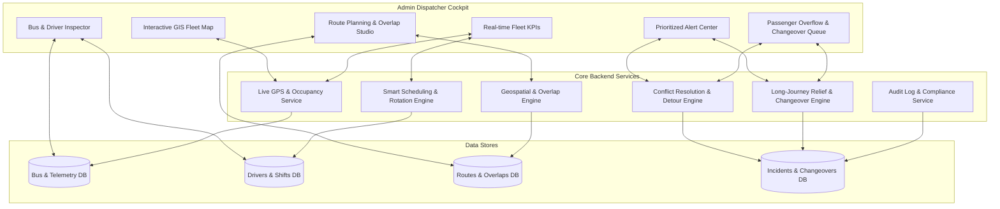
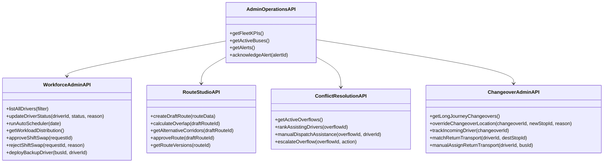
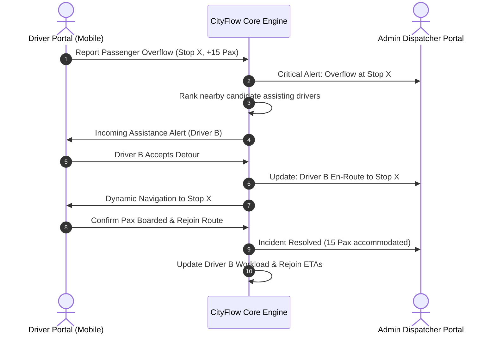

# CityFlow — Admin & Dispatcher Portal Feature Specification

This document provides the authoritative, exhaustive specification of all **Admin Portal & Dispatcher Console features** for the **CityFlow** intelligent transit ecosystem, derived from all 8 GitHub issues (`#1` through `#8`) on [shi-ivam/CityFlow](https://github.com/shi-ivam/CityFlow).

---

## 📑 Table of Contents

1. [Executive Summary & Operational Scope](#1-executive-summary--operational-scope)
2. [GitHub Issues Mapping Matrix (Admin Focus)](#2-github-issues-mapping-matrix-admin-focus)
3. [Admin Architecture & Data Flow](#3-admin-architecture--data-flow)
4. [Admin / Dispatcher Portal Feature Modules & TODO List](#4-admin--dispatcher-portal-feature-modules--todo-list)
   - [Module 1: Unified Transport Operations Command Center](#module-1-unified-transport-operations-command-center)
   - [Module 2: Central Driver Workforce & Backup Pool Orchestration](#module-2-central-driver-workforce--backup-pool-orchestration)
   - [Module 3: Smart Driver Scheduling, Fair Route Rotation & Workload Balancing](#module-3-smart-driver-scheduling-fair-route-rotation--workload-balancing)
   - [Module 4: Interactive Route Planning Studio & Overlap Conflict Detection](#module-4-interactive-route-planning-studio--overlap-conflict-detection)
   - [Module 5: Intelligent Conflict Resolution & Dynamic Overflow Dispatch](#module-5-intelligent-conflict-resolution--dynamic-overflow-dispatch)
   - [Module 6: Long-Journey Driver Relief & Return Transport Management](#module-6-long-journey-driver-relief--return-transport-management)
   - [Module 7: Security, Role-Based Access Control & System Audit Trails](#module-7-security-role-based-access-control--system-audit-trails)
5. [Backend Endpoints & Service Integration](#5-backend-endpoints--service-integration)
6. [Cross-Portal Synchronization (Admin <-> Driver)](#6-cross-portal-synchronization-admin---driver)
7. [Implementation Roadmap & Milestones](#7-implementation-roadmap--milestones)

---

## 1. Executive Summary & Operational Scope

The **CityFlow Admin / Dispatcher Portal** serves as the central mission-control command center for municipal transit authorities, operations dispatchers, route network planners, and depot supervisors.

### Core Responsibilities
1. **Real-Time Fleet Oversight**: Live telemetry, delay tracking, passenger occupancy levels, and operational health across all active routes.
2. **Dynamic Workforce Orchestration**: Automated multi-constraint driver scheduling, fatigue compliance, route rotation fairness, and backup driver mobilization.
3. **Spatial Network Optimization**: Interactive map-based route planning, automated spatial overlap detection, and version-controlled route staging.
4. **Autonomous & Assisted Incident Resolution**: Rapid response to passenger overflows, emergency detours, and long-journey driver changeovers.
5. **Auditing & Policy Enforcement**: Comprehensive logging, regulatory rest compliance, and operational KPI reporting.

---

## 2. GitHub Issues Mapping Matrix (Admin Focus)

| Issue # | Domain & Title | Admin Portal Functional Domain | Key Dispatcher / Admin Capabilities |
|---|---|---|---|
| **#1 & #4** | **Smart Driver Scheduling, Workforce Management & Fair Route Rotation** | Workforce Management & Scheduling Core | Multi-constraint auto-scheduler, rotation balance monitor (Short/Medium/Long), fatigue compliance tracker, shift swap approvals, backup pool management. |
| **#2 & #5** | **Interactive Route Planning Studio & Route Overlap Detection** | Route Network Planning & GIS Studio | Map route creation studio, click-to-add stops, automated distance/time calculations, % route overlap calculator, conflict severity heatmap, route staging & approval workflow. |
| **#3 & #6** | **Unified Transport Operations Dashboard** | Central Operations Cockpit | Unified KPI metrics, live multi-layer map, bus inspector, driver timeline matrix, route coverage tracker, prioritized alert center. |
| **#1 & #7** | **Intelligent Conflict Resolution, Passenger Overflow & Dynamic Rerouting** | Real-Time Incident & Overflow Dispatch | Live overflow incident monitor, candidate assisting driver ranking engine, manual dispatch override, detour & optimal rejoin path visualizer, standby bus deployment. |
| **#8** | **Long-Journey Driver Relief, Changeovers & Return Transport** | Long-Journey Relief & Changeover Operations | Configurable 200 km threshold, automated changeover stop scoring, manual location override, advance replacement driver reservation, delay ripple calculator, return transit matching on active passenger buses. |

---

## 3. Admin Architecture & Data Flow

---

## 4. Admin / Dispatcher Portal Feature Modules & TODO List

> **Status Key:**
> - `[x]` **Implemented / Active** in codebase
> - `[ ]` **Pending / To be Implemented**

---

### Module 1: Unified Transport Operations Command Center
*(Ref: Issues #3, #6)*

The unified cockpit provides dispatchers with an instantaneous, 360-degree situational awareness of the transit network.

- [x] **Top Operations Navigation & Global Status**:
  - Live active bus counter ([`TopNavbar.tsx`](file:///home/shivam/Projects/CityFlow/src/components/Navigation/TopNavbar.tsx))
  - Quick-switch navigation between Live Map Cockpit, Driver Portal, and Admin Control views
- [x] **Interactive Multi-Layer Spatial Map**:
  - High-performance GIS canvas rendering active transit routes, bus stop markers, and live moving vehicles ([`ChennaiTransitMap.tsx`](file:///home/shivam/Projects/CityFlow/src/components/Map/ChennaiTransitMap.tsx))
  - Support for multiple map tile providers (Carto Dark, Carto Light, OSM, MapTiler 3D)
  - Toggleable spatial safety buffers / route corridor corridors
- [x] **Real-Time Bus Telemetry Simulation & Telemetry Loop**:
  - Continuous interpolation of bus coordinates, forward/reverse headings, speed (km/h), and next stop ETA calculations ([`App.tsx`](file:///home/shivam/Projects/CityFlow/src/App.tsx))
  - Interactive playback controls: Play/Pause simulation, speed multipliers (1x, 2x, 4x), and reset
- [ ] **Fleet-Wide Live KPI Metric Cards**:
  - **Active Fleet Ratio**: Total operational buses vs scheduled fleet
  - **Network On-Time Performance (OTP %)**: Proportion of vehicles within +/- 3 minutes of schedule
  - **Driver Workforce Utilization**: Percentage of active drivers on-duty vs on-break vs resting
  - **Active Critical Alerts**: Count of unacknowledged high-priority system alerts
  - **Active Overflows & Changeovers**: Count of ongoing passenger overflows and active driver changeovers
- [ ] **Bus Tracking List & Detailed Inspector Sidepanel**:
  - Searchable list of all active buses filterable by Route, Status (`ON_TIME`, `DELAYED`, `EARLY`), and Depot
  - Inspector card showing:
    - Assigned Driver ID & Name
    - Current Speed, Heading, and GPS Coordinates
    - Real-Time Passenger Load Gauge (Seats occupied / total capacity)
    - Distance to next stop and real-time arrival ETA
    - 1-click Dispatcher Action buttons: *Reassign Driver*, *Broadcast Message*, *Initiate Detour*
- [ ] **Route Coverage & Unassigned Route Matrix**:
  - Live matrix showing all published routes with coverage status (Full, Partial, Unassigned)
  - Visual alert highlight for unassigned routes with 1-click *Auto-Assign Best Driver* action
- [ ] **Schedule & Driver Gantt Timeline Matrix**:
  - Daily horizontal Gantt visualization displaying bus duty blocks, driver shift intervals, scheduled breaks, and planned handover points
- [ ] **Prioritized Operational Alert Center**:
  - Alert stream ranked by severity:
    - 🔴 **CRITICAL**: Bus breakdown, passenger overflow without assigned driver, emergency stop
    - 🟠 **HIGH**: Imminent driver fatigue limit violation, incoming relief driver delayed >15 min
    - 🟡 **MEDIUM**: Route delay >10 min, high route overlap detected (>60%)
    - 🔵 **LOW**: Shift swap request submitted, route staged for review
  - 1-click Acknowledge, Dismiss, or Escalate actions per alert

---

### Module 2: Central Driver Workforce & Backup Pool Orchestration
*(Ref: Issues #2, #4, #6)*

Manages the fleet-wide pool of transit drivers, ensuring sufficient workforce availability while maintaining safety and labor compliance.

- [x] **Central Driver Directory API**:
  - REST endpoint listing all registered drivers with operational statuses, assigned routes, and shift times ([`backend/main.py`](file:///home/shivam/Projects/CityFlow/backend/main.py))
- [x] **Driver Operational Status State Machine**:
  - Tracks duty states: `AVAILABLE`, `ON_DUTY`, `ON_BREAK`, `REST_REQUIRED`, `UNAVAILABLE`, `BACKUP`, `ON_STANDBY`, `SUSPENDED`
- [x] **Driver Profile & Service Hours Backend**:
  - Service layer computing continuous driving hours, shift duration, fatigue percentage, and next shift allocation ([`backend/services/driver_service.py`](file:///home/shivam/Projects/CityFlow/backend/services/driver_service.py))
- [ ] **Workforce Pool Dispatcher Console UI**:
  - Comprehensive data grid of all drivers with multi-column sorting (Status, Continuous Hours Driven, Depot, Weekly Distance)
  - Quick filter tabs: *All*, *On Duty*, *Available*, *Standby / Backup*, *Mandatory Rest*
  - Manual driver status override controls with mandatory audit reason capture
- [ ] **Standby & Backup Driver Pool Orchestration**:
  - Dedicated reserve pool dashboard showing ready-to-deploy standby drivers
  - Automated rule-based backup trigger: When an on-duty driver reports sick or misses shift, system recommends the top-ranked backup driver
  - 1-click *Deploy Backup Driver* modal with automatic bus reassignment
  - Automatic return of backup drivers to available pool upon duty completion
- [ ] **Shift Swap & Leave Approval Queue**:
  - Dispatcher review dashboard for submitted driver shift swap and time-off requests
  - Automated safety validation: Displays whether the proposed swap creates fatigue violations or mandatory rest conflicts
  - 1-click *Approve Swap* (automatically swaps driver schedules) or *Reject Swap* (with dispatcher feedback)

---

### Module 3: Smart Driver Scheduling, Fair Route Rotation & Workload Balancing
*(Ref: Issues #1, #2, #3, #4)*

Automates the assignment of drivers to routes and buses, preventing burnout and ensuring equity across the workforce.

- [ ] **Smart Multi-Constraint Automated Scheduler**:
  - Intelligent assignment solver ensuring:
    1. Every active bus has an eligible, qualified driver
    2. Drivers in mandatory rest or unavailable status are never scheduled
    3. Maximum continuous driving limits and weekly hour caps are strictly respected
    4. Depot proximity and vehicle type qualifications are matched
- [ ] **Fair Route Rotation Engine**:
  - Automatic classification of routes into distance bands:
    - **Short Routes**: < 20 km
    - **Medium Routes**: 20 – 50 km
    - **Long Routes**: > 50 km
  - Rotation algorithm ensuring balanced historical exposure across all three categories
  - **Consecutive Long Route Prevention**: Automatically deprioritizes drivers who have operated long routes in recent shifts
  - Rotation Fairness Index score per driver and fleet-wide Gini coefficient
- [ ] **Fleet Workload Balancing Visualizer**:
  - Interactive histogram and scatter plot of cumulative weekly driving hours and mileage
  - Identifies overloaded drivers (>85% capacity) and underutilized drivers (<40% capacity)
  - Automated workload rebalancing recommendation generator
- [ ] **Dispatcher Manual Schedule Override Studio**:
  - Drag-and-drop schedule adjustment interface
  - Real-time constraint checking during manual edits (alerts if a drag-drop creates a fatigue violation)

---

### Module 4: Interactive Route Planning Studio & Overlap Conflict Detection
*(Ref: Issues #2, #5)*

Enables transit network planners to design new routes, optimize stops, and detect spatial conflicts with existing routes before deployment.

- [ ] **Interactive Map Route Designer**:
  - Point-and-click waypoints and bus stop placement on GIS canvas
  - Dynamic route geometry generation with road network snapping (OSRM / Mapbox Directions)
  - Stop sequencing, terminal designation, and dwell time configuration
- [ ] **Automated Route Metrics Calculation**:
  - Instant calculation of total route distance (km), estimated cycle time, stop count, and speed profile
  - Automatic categorization into Short, Medium, or Long route category
- [ ] **Automated Spatial Overlap & Shared Stop Engine**:
  - Spatial buffer intersection analysis comparing proposed route against all existing active routes
  - Computes exact **Route Overlap Percentage (%)**:
    $$\text{Overlap \%} = \frac{\text{Overlapping Corridor Length (km)}}{\text{Total Proposed Route Length (km)}} \times 100$$
  - Identifies shared bus stops and calculates stop overlap ratio
- [ ] **Visual Overlap & Conflict Severity Heatmap**:
  - Color-coded corridor visualization on map:
    - 🟢 **Low Overlap** (< 25%): Minimal congestion impact
    - 🟡 **Medium Overlap** (25% – 50%): Monitor stop dwell times
    - 🟠 **High Overlap** (50% – 75%): Potential fleet cannibalization
    - 🔴 **Critical Conflict** (> 75%): Requires alternative corridor routing
- [ ] **Alternative Corridor Recommender**:
  - Algorithmic suggestion of alternative parallel streets or bypass corridors to reduce overlap below target threshold
- [ ] **Route Staging, Versioning & Approval Workflow**:
  - Staging isolation: Proposed routes remain in `DRAFT` status and do not affect live dispatch
  - Version control system (`v1.0`, `v1.1`, `v2.0`) preserving historical revisions and geometry
  - Side-by-side comparison inspector (Draft vs Active route)
  - 1-click *Publish to Production* action triggering automatic schedule and driver allocation updates

---

### Module 5: Intelligent Conflict Resolution & Dynamic Overflow Dispatch
*(Ref: Issues #1, #7)*

Handles operational contingencies where passenger demand exceeds vehicle capacity through automated multi-bus coordination.

- [ ] **Real-Time Passenger Overflow Incident Queue**:
  - Live incident stream triggered when drivers report stranded passengers at crowded stops
  - Incident card displays: Bus ID, Stop Name, Reported Waiting Passengers, Current Occupancy, Timestamp
  - Real-time state machine: `DETECTED` → `SEARCHING` → `ASSIGNED` → `DETOURING` → `PICKING_UP` → `REJOINING` → `RESOLVED`
- [ ] **Assisting Driver Multi-Factor Ranking Engine**:
  - Algorithmic scoring of nearby active and backup drivers based on:
    1. **Proximity & Detour ETA** (Distance to overflow stop)
    2. **Available Bus Capacity** (Remaining passenger capacity $\ge$ overflow count)
    3. **Driver Fatigue & Remaining Duty Hours** (Ensures detour will not breach rest rules)
    4. **Schedule Impact on Original Route** (Minimizes downstream passenger delays)
    5. **Workload Equity** (Prefers underloaded drivers)
- [ ] **Dispatcher Manual Dispatch Controls**:
  - Override option to manually select any available vehicle or dispatch a dedicated reserve bus
  - Broadcast emergency dispatch request to target driver with customizable timeout
- [ ] **Detour & Rejoin Geometry Visualizer**:
  - Map overlay displaying:
    - Original scheduled route polyline (preserved)
    - Dynamic temporary pickup branch from assisting bus to overflow stop
    - Optimal calculated rejoin trajectory back to original corridor
- [ ] **Escalation & Fallback Manager**:
  - Automatic escalation when no suitable assisting driver accepts within timeout window
  - Dispatcher tools to order a depot standby bus, split the route, or coordinate with adjacent transit lines
- [ ] **Post-Incident Analytics & Audit Log**:
  - Complete timeline of overflow resolution, extra passenger volume handled, detour mileage added, and impact on on-time performance

---

### Module 6: Long-Journey Driver Relief & Return Transport Management
*(Ref: Issue #8)*

Automates the segmentation of long-distance intercity routes into safe driving shifts and coordinates return transit for relieved drivers.

- [ ] **Long-Journey Identification & Configurable Policy**:
  - Automatic identification of routes exceeding changeover threshold
  - Configurable relief distance parameter (default **200 km**, adjustable per fleet policy: e.g. 150 km, 180 km, 220 km)
- [ ] **Automated Relief Location Scoring & Generation**:
  - Algorithmic segmentation of long routes into $\sim 200	ext{ km}$ segments (e.g. 800 km route $
ightarrow$ 4 segments with 3 relief points)
  - Scores potential changeover stops based on:
    - Proximity to target distance threshold
    - Safety, lighting, and rest facilities at station/terminal
    - Accessibility for incoming relief drivers
- [ ] **Dispatcher Manual Changeover Location Override**:
  - Interface allowing dispatchers to manually adjust recommended relief points
  - Preserves original system recommendation alongside final chosen location with required justification notes
- [ ] **Advance Replacement Driver Reservation**:
  - Automatically identifies, schedules, and reserves qualified replacement drivers in advance
  - Enforces mandatory rest and rotation rules (prevents assigning drivers who recently finished long routes)
- [ ] **Changeover Real-Time Tracking & Delay Ripple Calculator**:
  - Live dashboard section showing all upcoming, in-progress, and completed changeovers
  - Tracks incoming replacement driver travel to changeover station
  - **Early Delay Warning**: Alerts dispatcher if incoming driver ETA exceeds scheduled bus arrival
  - **Contingency Checks**: Evaluates if current driver can legally extend duty temporarily or mobilizes backup driver
- [ ] **Outgoing Driver Return Transportation Matcher**:
  - Automated search algorithm that queries active regular passenger buses travelling toward the relieved driver's home depot/destination
  - **Capacity Verification**: Validates that candidate return buses have available passenger capacity before offering transit
  - **Ranking**: Ranks return bus options by departure time, arrival ETA, and transfer count
- [ ] **Return Transport Operations Monitor**:
  - Live tracker for outgoing drivers returning home: `REQUESTED` → `ACCEPTED` → `ONBOARD` → `COMPLETED`
  - Fallback hotline & manual dispatcher booking for drivers stranded without available bus connections
- [ ] **Segmented Duty Workload Accounting**:
  - Automatically splits long route distance and records exact segment mileage to each driver's record, preventing false 800 km workload bloat

---

### Module 7: Security, Role-Based Access Control & System Audit Trails
*(Ref: All Issues)*

Ensures data integrity, operational accountability, and regulatory compliance.

- [ ] **Role-Based Access Control (RBAC)**:
  - **Super Administrator**: Full system configuration, policy rules, user management, and DB access
  - **Operations Dispatcher**: Real-time fleet tracking, manual dispatches, shift swap approvals, and alert management
  - **Network Route Planner**: Route planning studio, overlap analysis, and route staging
  - **Depot Supervisor**: Driver check-in/out, local workforce status, and vehicle maintenance logging
- [ ] **Comprehensive Immutable Audit Log**:
  - System-wide audit trail recording every significant operational action:
    - Manual driver schedule overrides
    - Shift swap approvals / rejections
    - Route activations and modifications
    - Manual emergency dispatches and overflow interventions
    - Changeover location overrides and duty extensions
  - Searchable and exportable (CSV / JSON / PDF) for regulatory and labor union audits

---

## 5. Backend Endpoints & Service Integration

### Complete Admin API Endpoint Registry

| Method | Endpoint | Description | Ref Issue |
|---|---|---|---|
| `GET` | `/api/admin/kpis` | Real-time fleet KPIs and network summary | Issue #3, #6 |
| `GET` | `/api/admin/buses/live` | Live bus telemetry, occupancy, and status | Issue #3, #6 |
| `GET` | `/api/admin/alerts` | Prioritized alert center stream | Issue #3, #6 |
| `POST` | `/api/admin/alerts/{id}/ack` | Acknowledge or resolve an operational alert | Issue #3, #6 |
| `GET` | `/api/admin/drivers` | Fleet-wide driver workforce with full statuses | Issue #1, #4 |
| `PUT` | `/api/admin/drivers/{id}/status` | Manual driver status override | Issue #1, #4 |
| `POST` | `/api/admin/schedule/auto` | Trigger smart multi-constraint auto-scheduler | Issue #1, #4 |
| `GET` | `/api/admin/workload/analytics` | Workload balancing & rotation fairness metrics | Issue #1, #3, #4 |
| `GET` | `/api/admin/shift-swaps/pending` | Queue of pending shift swap requests | Issue #1, #4 |
| `POST` | `/api/admin/shift-swaps/{id}/review` | Approve or reject driver shift swap | Issue #1, #4 |
| `POST` | `/api/admin/routes/draft` | Create or edit draft route geometry | Issue #2, #5 |
| `POST` | `/api/admin/routes/overlap-analysis` | Compute % overlap and shared stops | Issue #2, #5 |
| `POST` | `/api/admin/routes/{id}/publish` | Approve draft route and publish to production | Issue #2, #5 |
| `GET` | `/api/admin/conflicts/overflows` | Stream of active passenger overflow incidents | Issue #1, #7 |
| `GET` | `/api/admin/conflicts/overflows/{id}/candidates` | Ranked candidate assisting drivers | Issue #1, #7 |
| `POST` | `/api/admin/conflicts/overflows/{id}/dispatch` | Dispatch selected assisting driver | Issue #1, #7 |
| `GET` | `/api/admin/changeovers` | Active, upcoming, and delayed long journeys | Issue #8 |
| `PUT` | `/api/admin/changeovers/{id}/override-stop` | Override recommended relief stop | Issue #8 |
| `GET` | `/api/admin/changeovers/return-transport` | Queue of return transport requests | Issue #8 |
| `POST` | `/api/admin/changeovers/{id}/escalate` | Dispatcher fallback for stranded driver | Issue #8 |
| `GET` | `/api/admin/audit-logs` | Searchable system audit and compliance trail | All Issues |

---

## 6. Cross-Portal Synchronization (Admin <-> Driver)

The Admin and Driver portals maintain synchronized real-time state via event-driven pub/sub and WebSocket channels:

---

## 7. Implementation Roadmap & Milestones

1. **Phase 1: Operations Cockpit & Workforce Grid** *(Issues #3, #4, #6)*
   - Wire real-time Fleet KPIs and interactive Bus Inspector
   - Build Dispatcher Driver Workforce data grid with shift swap review queue
2. **Phase 2: Route Planning Studio & Overlap Engine** *(Issues #2, #5)*
   - Implement MapRouteStudio with click-to-draw waypoints and automated % overlap calculator
   - Build visual corridor heatmap and route staging workflow
3. **Phase 3: Automated Scheduling & Rotation Balancer** *(Issues #1, #4)*
   - Build auto-scheduling solver respecting fatigue and Short/Medium/Long rotation constraints
   - Add Workload Distribution & Fairness analytics
4. **Phase 4: Conflict Resolution & Long-Journey Orchestration** *(Issues #7, #8)*
   - Build Passenger Overflow Dispatcher Console with candidate ranking
   - Implement Long-Journey Relief manager with 200 km thresholding and return bus matcher
